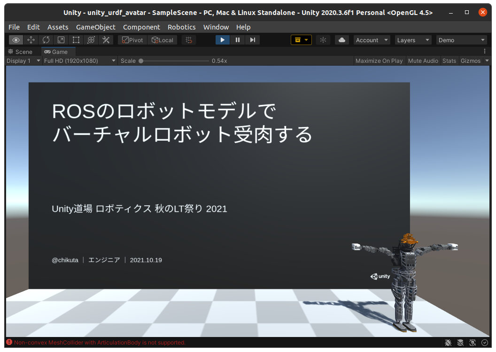

# Valkyrie avatar unity

## 概要

[Unity道場 ロボティクス 秋のLT祭り 2021](https://youtu.be/LlQX-BVLeRg?t=9091) のライブデモで使用したソースコードです。



## 実行環境

* Ubuntu 20.04
* ROS1 noetic
* python 3
* Unity 2020.3.6f1

## 実行方法

1. UnityProjectをダウンロード

```bash
git clone https://github.com/chikuta/unity_urdf_avatar.git
```

2. ダウンロードしたProjectをUnityで読み込む

3. [Bio IK](https://assetstore.unity.com/packages/tools/animation/bio-ik-67819?locale=ja-JP) を購入

4. UnityEditor画面より、[Window]→[Package Manager]→[My Asset] から Bio IK をインポート

5. [mediapipe_ros](./ROS/mediapipe_ros) の README を参考にして ros node を実行

6. UnityEditorからゲームを実行


## 操作方法

### スライド移動

* ↑ - スライドを戻る
* ↓ - スライドを進める

### ロボット操作

ros node を起動すると認識された人間の姿勢が表示されます。
左右の手首がロボットの手首位置の指令値として使用されます。

## LICENSE

* MIT
